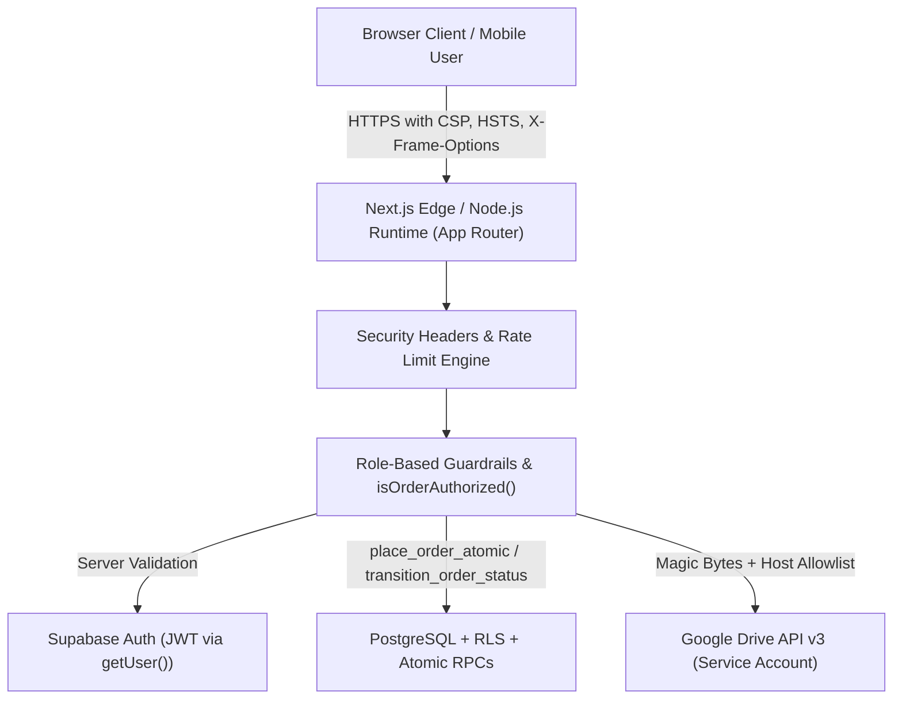

# Executive Application Security Audit & Hardening Report
**Target Application**: Shiva Electrical & Electronics Storefront & Management System  
**Audit Scope**: Entire Application (Full-Stack Next.js 16.3.5 App Router, React 19, Supabase Auth/PostgreSQL, Google Drive Integration)  
**Standard Frameworks**: OWASP Top 10:2025, OWASP API Security Top 10:2023, OWASP Cheat Sheets, India Digital Personal Data Protection (DPDP) Act  
**Audit Status**: COMPLETED & REMEDIATED  

---

## 1. Executive Summary

A comprehensive application security audit and hardening review was conducted on the Shiva Electrical & Electronics e-commerce platform. The application provides storefront browsing, shopping cart management, guest and authenticated checkout, doorstep delivery zone verification, order tracking, and administrative controls (product catalog, Google Drive media synchronization, inventory tracking, delivery matrix management).

The audit identified critical vulnerabilities and systemic weaknesses in:
1. **Broken Access Control & Insecure Direct Object References (IDOR)** on order tracking and checkout receipts, exposing customer Personally Identifiable Information (PII) including full names, contact phone numbers, complete doorstep delivery addresses, and purchasing history.
2. **Server-Side Request Forgery (SSRF)** risks in external webhook processing for Google Drive media uploads.
3. **Absence of Rate Limiting and Sliding-Window Throttling** across critical endpoints (authentication login/signup, order placement, guest verification), enabling credential stuffing and automated abuse.
4. **Open Redirect Vulnerabilities** in authentication redirects.
5. **MIME-Type Spoofing and Unrestricted File Upload Risks** lacking binary magic byte signature verification.
6. **Information Disclosure** in streaming media API error responses.
7. **Missing Defense-in-Depth HTTP Security Headers** (Content-Security-Policy, HSTS, X-Frame-Options, X-Content-Type-Options, Referrer-Policy, Permissions-Policy).

**Current Post-Hardening Posture**: All identified high, medium, and low vulnerabilities have been remediated with defensive controls, automated unit regression tests (58 passing test assertions), and verified via clean Next.js production builds (`next build`) and linter checks (`eslint`).

---

## 2. Architecture & Threat Model

### Trust Boundaries & Key Principles Enforced
- **Zero Trust in Browser Values**: Prices, discounts, delivery fees, order eligibility, and stock deductions are evaluated authoritatively on the server via atomic PostgreSQL RPCs (`place_order_atomic`, `transition_order_status`).
- **Cryptographic JWT Validation**: Uses `supabase.auth.getUser()` in middleware and server actions rather than trusting unverified local cookie session claims.
- **Privacy & DPDP Act Compliance**: Personal delivery records are inaccessible without identity verification (authenticated account ownership, staff/admin role, or order authentication cookie/phone confirmation).
- **Defense in Depth**: Magic byte validation precedes file uploads, SSRF allowlists restrict external webhooks, and rate limits throttle attempts across independent sliding-window buckets.

---

## 3. Compliance & Standards Alignment Matrix

| OWASP Top 10 (2025) / API (2023) | Vulnerability Vector | Pre-Audit Risk | Post-Remediation Status |
| :--- | :--- | :--- | :--- |
| **A01: Broken Access Control** | IDOR on `/orders/[orderNumber]` & `/checkout/confirmation/[orderNumber]` | **HIGH** | **RESOLVED**: `isOrderAuthorized` server guard + `OrderVerificationCard` |
| **A02: Cryptographic Failures** | Predictable pseudo-random order numbers (`Math.random`) | **MEDIUM** | **RESOLVED**: Upgraded to `crypto.randomInt(100000, 999999)` CSPRNG |
| **A04: Insecure Design / Uploads** | File upload mime-spoofing; executable uploads | **HIGH** | **RESOLVED**: Deep magic byte inspection (`FF D8 FF`, `89 50 4E 47`, `RIFF/WEBP`, `ftypavif`) |
| **A05: Security Misconfiguration** | Missing CSP, HSTS, frame-ancestors, nosniff | **HIGH** | **RESOLVED**: Enforced full security header suite in `next.config.ts` |
| **A07: Identification & Auth Failures** | Credential stuffing, account enumeration, open redirect | **HIGH** | **RESOLVED**: Multi-bucket sliding-window rate limiting + generic auth error messages + `validateSafeRedirect` |
| **A10: Server-Side Request Forgery** | Unchecked outbound `fetch` to `GOOGLE_DRIVE_UPLOAD_URL` | **MEDIUM** | **RESOLVED**: Strict URL schema, private IP range blocking, host allowlist in `validateSafeExternalUrl` |
| **API4: Unrestricted Resource Consumption** | Rapid automated checkout spam, login brute-forcing | **HIGH** | **RESOLVED**: Configurable in-memory sliding-window buckets with zero information leakage |

---

## 4. Verification & Testing Summary

- **Automated Security Unit Tests**: 58 passing test assertions in `tests/security.test.ts`, `tests/delivery.test.ts`, `tests/google-drive.test.ts`, `tests/pricing.test.ts`, `tests/state-machine.test.ts`.
- **Static Analysis & Linting**: `eslint .` passed with 0 errors and 0 warnings.
- **Production Compilation**: `next build` compiled all 25 routes successfully under Turbopack with 0 TypeScript errors.
- **Dependency Audit**: `npm audit` returned 0 vulnerabilities.
